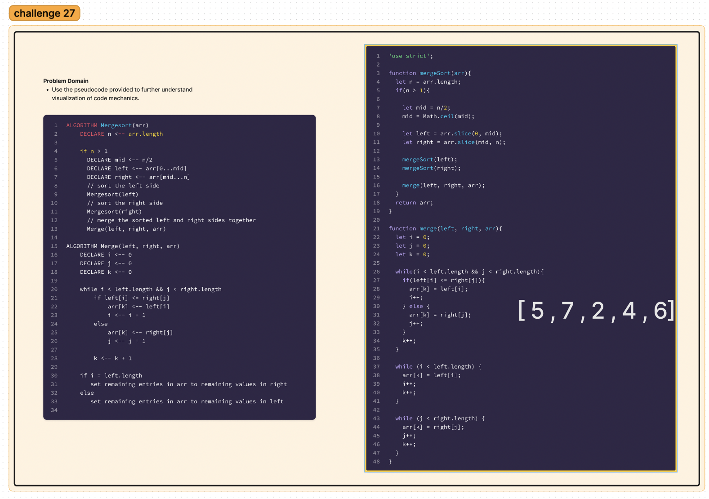
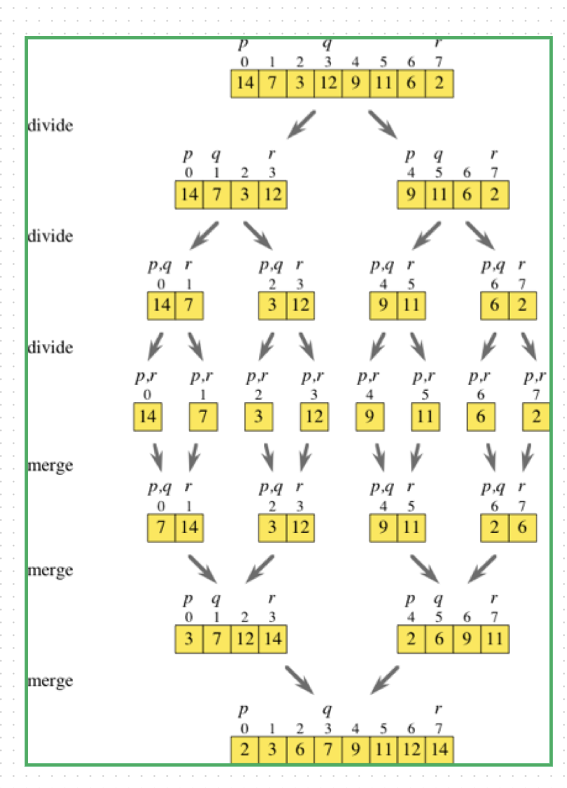

## Challenge: List Insertions
Merge Sort is the sorting of arrays or lists.

## Approach & Efficiency
Big O
Time:  O(n log n)
Space: O(n)

## Blog Article:
Title: Understanding Merge Sort: A Divide and Conquer Sorting Algorithm

Introduction:
Sorting algorithms play a fundamental role in computer science, allowing us to arrange elements in a specific order efficiently. One such algorithm is Merge Sort, which follows the divide and conquer approach. In this article, we will explore the step-by-step process of Merge Sort, understand its underlying algorithm, and analyze its performance characteristics.

Merge Sort Algorithm:
The Merge Sort algorithm can be broken down into the following steps:

Divide: The algorithm begins by dividing the input array into smaller subarrays until each subarray contains only one element. This recursive division is a key aspect of the algorithm.

Merge: After dividing the array, the algorithm starts merging the subarrays back together in a sorted manner. It compares the elements at corresponding indices of the subarrays and selects the smaller (or larger) element to be placed in the merged array.

Base Case: The recursion continues until the base case is reached, which occurs when a subarray has only one element. At this point, the subarray is considered sorted, and the merging process begins.

Merging Process: During the merging process, the algorithm compares the elements from the divided subarrays and merges them into a new array. It iterates through the subarrays, comparing the elements at each index and placing them in the correct order in the merged array.

Final Sorted Array: Once all the subarrays are merged, the algorithm returns the fully sorted array as the final output.

Step-by-Step Walkthrough:
To better understand the Merge Sort algorithm, let's walk through an example using the input array [8, 4, 23, 42, 16, 15]:

Initial call: mergeSort([8, 4, 23, 42, 16, 15])

The array is divided into smaller subarrays, and the algorithm is recursively called on each subarray.
Recursive calls and merging:

The algorithm further divides the array until the base case is reached (subarray size = 1).
It starts merging the subarrays back together in a sorted manner, comparing and rearranging the elements.
Final sorted array: The algorithm returns the fully sorted array [4, 8, 15, 16, 23, 42] as the result.

Performance Analysis:
Merge Sort has a time complexity of O(n log n), where n is the number of elements in the input array. This makes it efficient for large datasets. Additionally, Merge Sort is a stable sorting algorithm, preserving the relative order of elements with equal values.

Conclusion:
Merge Sort is a powerful sorting algorithm that follows the divide and conquer approach. By dividing the array into smaller subarrays, recursively sorting them, and merging them back together, Merge Sort efficiently sorts elements in ascending or descending order. Its time complexity of O(n log n) and stability make it a popular choice in various applications.

Understanding Merge Sort provides valuable insights into sorting algorithms and their efficiency. By grasping the underlying principles of Merge Sort, you'll be better equipped to analyze and implement efficient sorting solutions in your own programming endeavors.

## Whiteboard Process

## Collaborator
Kenya Womack, Francisco Sanchez, Tammy Do
